## Anggota Kelompok

| Nama Anggota | NRP |
| :--- | :--- |
| Syifa Nurul Alfiah | 5027241019 |
| Muhammad Fachry Shalahuddin Rusamsi | 5027241031 |
| Dimas Satya Andhika | 5027241032 |
| Abiyyu Raihan Putra Wikanto | 5027241042 |
| Ahmad Yafi Ar Rizq | 5027241066 |
| Afriza Tristan Calendra Rajasa | 5027241104 |
| Maritza Adelia Sucipto | 5027241111 |
| Putri Joselina Silitonga | 5027241116 |

---
## Rancangan Arsistektur


## Provisioning VM & Konfigurasi Firewall 

Bagian ini mendokumentasikan spesifikasi awal infrastruktur Virtual Machine (VM) yang digunakan dalam klaster proyek ini, serta arsitektur keamanan jaringan (VPC Firewall Rules) yang dikonfigurasi pada Google Cloud Platform.

### 1. Spesifikasi Klaster 3 Virtual Machine (VM)
Seluruh komponen sistem dideploy ke dalam 3 instance VM di region Jakarta dengan pembagian tugas sebagai berikut:

| Nama VM | Zone | IP Internal | IP External | Tipe Mesin / Spesifikasi | Estimasi Harga / Bulan |
| :--- | :--- | :--- | :--- | :--- | :--- |
| `frontend-server` | `asia-southeast2-a` | `10.184.0.2` | `34.50.117.141` | `e2-micro` (2 vCPU, 1 GB RAM, 10 GB Disk) | $9.52 |
| `backend-appserver` | `asia-southeast2-a` | `10.184.0.3` | `34.101.207.8` | `e2-small` (2 vCPU, 2 GB RAM, 10 GB Disk) | $17.74 |
| `database-mongodb` | `asia-southeast2-a` | `10.184.0.6` | `34.101.72.188` | `e2-medium` (2 vCPU, 4 GB RAM, 10 GB Disk) | $34.19 |
| **Total Estimasi Biaya** | | | | | **$61.45** |

---

### 2. Arsitektur Jaringan & Aturan VPC Firewall
Secara default, seluruh VM di GCP berada dalam kondisi tertutup dari koneksi luar demi alasan keamanan. Konfigurasi firewall network dipisahkan menjadi dua lapis kebijakan utama:

#### A. Isolasi Jaringan Internal (Amankan Komunikasi Antar-VM)
Memanfaatkan rule bawaan **`default-allow-internal`** yang mengizinkan komunikasi penuh antar-VM yang berada di dalam satu VPC lokal. 
* **Dampaknya:** Aplikasi Flask (Port 5000), Database MongoDB (Port 27017), dan Caching Redis (Port 6379) bisa saling bertukar data dengan lancar menggunakan **IP Internal**, tanpa perlu khawatir terekspos atau bisa diintip dari internet publik.

#### B. Pembukaan Akses Publik (Khusus Web Server Frontend)
Dibuat aturan kustom baru bernama **`allow-http-https`** serta mengaktifkan tag `http-server` dan `https-server` khusus untuk `vm2-nginx-frontend`.
* **Nama Rule:** `allow-http-https`
* **Target Tags:** `http-server`, `https-server`
* **Source IPv4 Ranges:** `0.0.0.0/0` (Terbuka untuk internet publik)
* **Protocols & Ports:** `tcp:80` (HTTP) dan `tcp:443` (HTTPS)
* **Fungsi:** Mengizinkan *traffic* dari luar (termasuk saat dilakukan pengujian beban menggunakan Locust Load Testing) untuk masuk mengakses Nginx Reverse Proxy di node frontend.

# Implementasi Database — MongoDB (database-mongodb)
> **VM:** `database-mongodb` | IP Internal: `10.184.0.6` | IP External: `34.101.72.188`
> **Spesifikasi:** 2 vCPU, 4 GB RAM, $34.19/bulan

---

## 1. Koneksi ke VM MongoDB

Akses VM melalui GCP Console:

1. Buka [https://console.cloud.google.com](https://console.cloud.google.com)
2. Login dengan akun Google yang sudah di-invite ke project
3. Navigasi ke **Compute Engine → VM Instances**
4. Cari baris `vm4-mongodb`, klik tombol **SSH**

Atau via terminal laptop:

```bash
ssh joselinesilitonga@34.101.207.8
```

---

## 2. Instalasi MongoDB 7.0

### 2.1 Import GPG Key

```bash
curl -fsSL https://www.mongodb.org/static/pgp/server-7.0.asc | sudo gpg -o /usr/share/keyrings/mongodb-server-7.0.gpg --dearmor
```

### 2.2 Tambahkan Repository MongoDB

```bash
echo "deb [ arch=amd64,arm64 signed-by=/usr/share/keyrings/mongodb-server-7.0.gpg ] https://repo.mongodb.org/apt/ubuntu jammy/mongodb-org/7.0 multiverse" | sudo tee /etc/apt/sources.list.d/mongodb-org-7.0.list
```

### 2.3 Install MongoDB

```bash
sudo apt-get update && sudo apt-get install -y mongodb-org
```

### 2.4 Jalankan dan Enable MongoDB

```bash
sudo systemctl start mongod && sudo systemctl enable mongod
```

### 2.5 Verifikasi Status

```bash
sudo systemctl status mongod
```

**Output yang diharapkan:**


> ✅ Pastikan statusnya `Active: active (running)` sebelum lanjut.

Tekan `q` untuk keluar dari tampilan status.

---

## 3. Restore Database dari Dump

### 3.1 Siapkan File Dump (di laptop lokal)

```bash
cd ~/Downloads
unzip fp-tka-26-main.zip
cd fp-tka-26-main/Resources/DB
zip -r dump.zip dump/
```

### 3.2 Upload ke VM

Di browser SSH, klik tombol **UPLOAD FILE** (pojok kanan atas), lalu pilih file `dump.zip` yang baru dibuat.

### 3.3 Install Unzip di VM

```bash
sudo apt install unzip -y
```

### 3.4 Ekstrak File Dump

```bash
unzip dump.zip
```

### 3.5 Restore ke MongoDB

```bash
mongorestore --db orderdb dump/orderdb/
```

**Output yang diharapkan:**


> ✅ Pastikan ada baris `12701 document(s) restored successfully. 0 document(s) failed to restore.`

Data yang ter-restore:
| Collection | Jumlah Dokumen |
|---|---|
| users | 505 |
| products | 96 |
| orders | 10.000 |
| audit_logs | 2.000 |
| sessions | 100 |

---

## 4. Pembuatan Index

Index diperlukan untuk mempercepat query, terutama pada endpoint `/admin/stats` yang memiliki aggregation pipeline berat.

```bash
mongosh orderdb --eval "
db.orders.createIndex({ user_id: 1, created_at: -1 });
db.orders.createIndex({ status: 1 });
db.orders.createIndex({ order_id: 1 }, { unique: true });
db.products.createIndex({ is_active: 1, category: 1 });
db.users.createIndex({ email: 1 }, { unique: true });
"
```

> ✅ MongoDB akan menampilkan nama index yang berhasil dibuat untuk setiap perintah.

---

## 5. Konfigurasi mongod.conf

### 5.1 Buka File Konfigurasi

```bash
sudo nano /etc/mongod.conf
```

### 5.2 Ubah Konfigurasi

Edit file sehingga menjadi seperti berikut:

```yaml
# mongod.conf

storage:
  dbPath: /var/lib/mongodb
  wiredTiger:
    engineConfig:
      cacheSizeGB: 1        # Tuning cache = setengah RAM vm4 (2GB)

systemLog:
  destination: file
  logAppend: true
  path: /var/log/mongodb/mongod.log

net:
  port: 27017
  bindIp: 0.0.0.0          # Agar bisa diakses dari app server lain

processManagement:
  timeZoneInfo: /usr/share/zoneinfo
```

**Screenshot konfigurasi:**


Simpan dengan: `Ctrl+X` → `Y` → `Enter`

### 5.3 Restart MongoDB

```bash
sudo systemctl restart mongod && sudo systemctl status mongod
```

---

## 6. Verifikasi Koneksi dan Data

### 6.1 Cek via URI Internal

```bash
mongosh mongodb://10.184.0.6:27017/orderdb --eval "db.stats()"
```

### 6.2 Tampilkan Statistik Database

```bash
mongosh orderdb --eval "db.stats()"
```

**Output yang diharapkan:**


```json
{
  db: 'orderdb',
  collections: Long('5'),
  views: Long('0'),
  objects: Long('12701'),
  indexes: Long('10'),
  ok: 1
}
```

> ✅ Pastikan `collections: 5`, `objects: 12701`, `indexes: 10`, dan `ok: 1`

---

## 7. Ringkasan Konfigurasi MongoDB

| Parameter | Nilai |
|---|---|
| Versi | MongoDB 7.0 |
| Port | 27017 |
| Database | orderdb |
| bindIp | 0.0.0.0 |
| WiredTiger Cache | 1 GB |
| Total Index | 10 |
| Total Dokumen | 12.701 |

**MONGO_URI untuk App Server:**
```
mongodb://10.184.0.6:27017/orderdb
```

## 8. Deployment Backend (App Server)
Layanan backend dideploy menggunakan Gunicorn dengan 4 worker pada 1 instance untuk mendukung efisiensi resource.<br>
**Konfigurasi Instance:**
- Web Server: Gunicorn (WSGI HTTP Server)
- Virtual Environment: Python 3.10 venv
- Dependency: Flask, PyMongo, Bcrypt, PyJWT, Gunicorn
- Port: 5000 (Internal)
<br>

### Daftar Instance Backend

| Instance | IP Address |
| :--- | :--- |
| backend-appserver | `34.101.207.8:5000` |


  Lalu jalankan perintah 
```
  # Setup Environment
source venv/bin/activate
export MONGO_URI="mongodb://10.184.0.6:27017/orderdb"

# Menjalankan Gunicorn sebagai daemon
gunicorn -w 4 -b 0.0.0.0:5000 app:app --daemon
```

## 9. Implementasi Load Balancer & Frontend (frontend-server)
> **VM:** `frontend-server` | IP Internal: `10.184.0.2` | IP External: `34.50.117.141`
> **Spesifikasi:** 1 vCPU, 1 GB RAM, $9.52/bulan

### 9.1 Instalasi dan Tuning Nginx
Nginx diinstal di server `vm2` sebagai Reverse Proxy, Load Balancer, sekaligus Web Server statis untuk menyajikan file frontend.
```bash
# Update package list dan install Nginx
sudo apt update && sudo apt install nginx -y

# Mengatur kepemilikan folder agar bisa dimodifikasi oleh user aktif
sudo chown -R $USER:$USER /var/www/html
sudo chmod -R 755 /var/www/html
```

Tuning dilakukan pada `/etc/nginx/sites-available/default` untuk menangani lonjakan traffic:
- `worker_processes auto`: Menyesuaikan thread worker secara dinamis dengan core CPU.
- `gzip on`: Mengurangi ukuran transfer file text (HTML/CSS/JS) sehingga menghemat bandwidth dan meningkatkan kecepatan muat halaman.
- `keepalive_timeout 65`: Mempertahankan koneksi TCP client tetap terbuka demi efisiensi handshake.

### 9.2 Konfigurasi Proxy (Upstream)
Kami mengonfigurasi upstream backend mengarah ke satu-satunya server backend yang aktif.

File `/etc/nginx/sites-available/default` yang dikonfigurasi:
```nginx
upstream backend {
    least_conn;
    server 10.184.0.3:5000 max_fails=3 fail_timeout=10s;
    keepalive 64;
}

server {
    listen 80 default_server;
    server_name _;
    root /var/www/html;
    index index.html;

    gzip on;
    gzip_types text/plain text/css application/json application/javascript;

    # Serve static frontend
    location / {
        try_files $uri $uri/ =404;
    }

    # API Rewrite & Proxy (mengatasi mismatch singular/plural dari frontend)
    location /order {
        if ($request_method = POST) { rewrite ^/order$ /orders break; }
        if ($request_method = GET) { rewrite ^/order/(.*)$ /orders/$1 break; }
        if ($request_method = PUT) { rewrite ^/order/(.*)$ /orders/$1/status break; }

        proxy_pass http://backend;
        proxy_http_version 1.1;
        proxy_set_header Connection "";
        proxy_set_header Host $host;
        proxy_set_header X-Real-IP $remote_addr;
        proxy_set_header X-Forwarded-For $proxy_add_x_forwarded_for;
        proxy_next_upstream error timeout http_500 http_502 http_503 http_504;
    }

    location /orders {
        proxy_pass http://backend;
        proxy_http_version 1.1;
        proxy_set_header Connection "";
        proxy_set_header Host $host;
        proxy_set_header X-Real-IP $remote_addr;
        proxy_set_header X-Forwarded-For $proxy_add_x_forwarded_for;
        proxy_next_upstream error timeout http_500 http_502 http_503 http_504;
    }

    location /auth/ {
        proxy_pass http://backend;
        proxy_http_version 1.1;
        proxy_set_header Connection "";
        proxy_set_header Host $host;
        proxy_set_header X-Real-IP $remote_addr;
        proxy_set_header X-Forwarded-For $proxy_add_x_forwarded_for;
    }

    location /products {
        proxy_pass http://backend;
        proxy_http_version 1.1;
        proxy_set_header Connection "";
        proxy_set_header Host $host;
        proxy_set_header X-Real-IP $remote_addr;
        proxy_set_header X-Forwarded-For $proxy_add_x_forwarded_for;
    }

    location /admin/ {
        proxy_pass http://backend;
        proxy_http_version 1.1;
        proxy_set_header Connection "";
        proxy_set_header Host $host;
        proxy_set_header X-Real-IP $remote_addr;
        proxy_set_header X-Forwarded-For $proxy_add_x_forwarded_for;
    }

    location /health {
        proxy_pass http://backend;
        proxy_http_version 1.1;
        proxy_set_header Connection "";
        proxy_set_header Host $host;
        proxy_set_header X-Real-IP $remote_addr;
        proxy_set_header X-Forwarded-For $proxy_add_x_forwarded_for;
    }
}
```

### 9.3 Konfigurasi Frontend (CORS-free)
File `index.html` dan `styles.css` disalin dari `Resources/FE/` ke `/var/www/html/` di `frontend-server`.
Kami mengubah variabel `API_BASE` pada file `index.html` menjadi:
```javascript
const API_BASE = "";
```
Dengan merujuk ke path kosong (`""`), semua API call dari browser diarahkan secara otomatis ke IP Load Balancer (`http://34.50.117.141`) port 80. Nginx bertindak sebagai gerbang tunggal yang menyajikan file statis sekaligus melakukan reverse proxy ke backend server, sehingga menghindari isu Cross-Origin Resource Sharing (CORS) tanpa membutuhkan konfigurasi tambahan pada sisi backend.

#### Screenshot Pendukung:
- **Status Nginx Active:**
  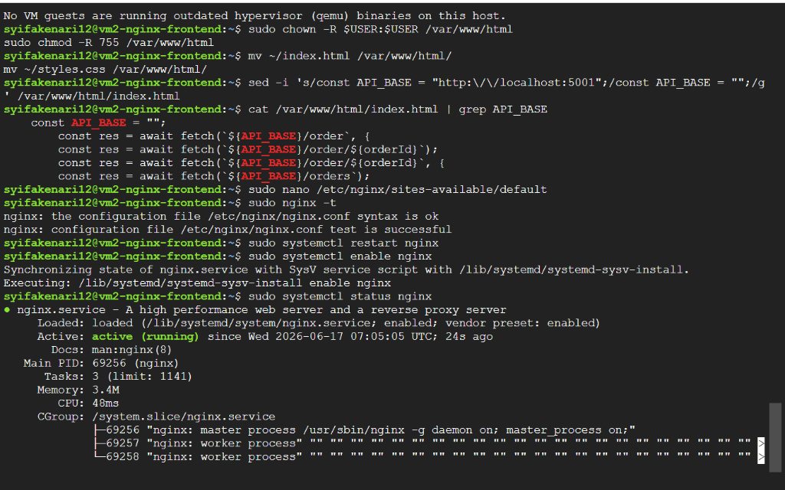
- **Tampilan Frontend:**
  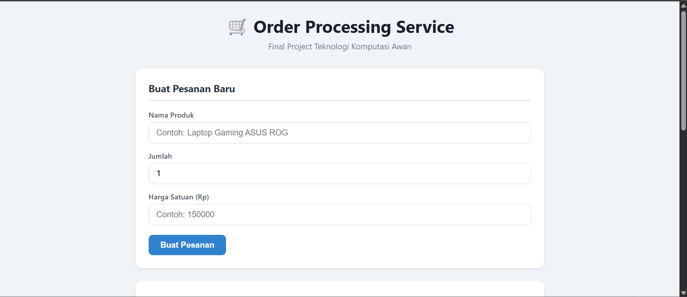

## 10. Ansible Deployment

Pada bagian ini dilakukan proses otomatisasi deployment menggunakan Ansible.
Tujuan dari konfigurasi ini adalah menyiapkan seluruh infrastruktur aplikasi:

- Backend Flask server
- MongoDB database server
- Nginx load balancer
- Systemd service untuk menjalankan aplikasi

| Komponen | Deskripsi |
|---|---|
| **Backend Flask** | Server aplikasi yang menangani request API |
| **MongoDB** | Database server untuk menyimpan data order |
| **Nginx** | Load balancer yang mendistribusikan traffic ke backend |
| **Systemd** | Service manager untuk menjalankan aplikasi secara otomatis |


### 10.1 Preparation

Sebelum menjalankan Ansible, pastikan:

- Semua VM sudah aktif
- SSH antar server dapat digunakan
- Python3 tersedia pada target server

### 10.2 Ansible Inventory Configuration

### Setup SSH Key

Langkah ini memungkinkan **vm4 (control node)** terhubung ke seluruh app server tanpa password.

**Di vm4 (control node)** — salin public key:

```bash
cat ~/.ssh/id_rsa.pub
```

**Di app1, app2, app3 (target server)** — tambahkan public key ke authorized_keys:

```bash
mkdir -p ~/.ssh
nano ~/.ssh/authorized_keys   # paste public key di sini
chmod 700 ~/.ssh
chmod 600 ~/.ssh/authorized_keys
```

Target server dan IP-nya:

| Server | IP |
|---|---|
| app1 | 10.184.0.3 |
| app2 | 10.184.0.4 |
| app3 | 10.184.0.5 |

**Test koneksi SSH dari vm4:**

```bash
ssh -i ~/.ssh/id_rsa maritzaadelia076@10.184.0.3
```

Output yang diharapkan:

```maritzaadelia076@vm3-appserver1-redis:~$```

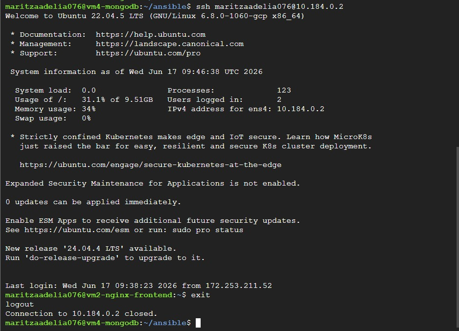

Check koneksi:

```bash
ansible all -i inventory.ini -m ping
```
 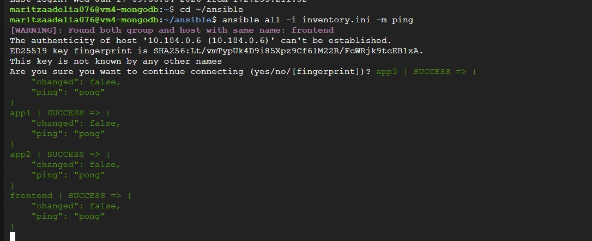
 
File:
`inventory.ini`

### File: `inventory.ini`

> **Fungsi:** Mendefinisikan seluruh server yang dikelola Ansible beserta kredensial dan konfigurasi koneksi SSH-nya. File ini menjadi referensi utama untuk semua perintah dan playbook Ansible.

Isi konfigurasi:
```bash
# Grup server frontend (Nginx load balancer)
[frontend_servers]
frontend1 ansible_host=10.184.0.2

# Grup server backend (Flask app)
[appservers]
app1 ansible_host=10.184.0.3

# Grup server database (MongoDB)
[mongodb]
mongo ansible_host=10.184.0.6

# Variabel global yang berlaku untuk semua host
[all:vars]
ansible_user=maritzaadelia076                                    # Username SSH di semua server
ansible_ssh_private_key_file=/home/maritzaadelia076/.ssh/id_rsa # Path ke private key
ansible_python_interpreter=/usr/bin/python3                      # Interpreter Python yang digunakan Ansible
ansible_become=true                                              # Aktifkan privilege escalation (sudo)
ansible_become_method=sudo                                       # Metode escalation menggunakan sudo
```

### 10.3 Backend Deployment
File:
`
setup_appserver.yml
`
### File: `setup_appserver.yml`

> **Fungsi:** Mengotomatisasi deployment aplikasi Flask ke semua app server. Playbook ini menginstal dependensi, menyalin source code, dan mendaftarkan aplikasi sebagai systemd service agar berjalan otomatis saat server restart.

```bash
---
- name: Setup Flask App Server
  hosts: appservers    # Dijalankan di semua server dalam grup [appservers]
  become: yes          # Jalankan sebagai root (sudo)

  tasks:

    # Pastikan package list up-to-date sebelum instalasi
    - name: Update packages
      apt:
        update_cache: yes

    # Install runtime Python dan Git untuk dependency management
    - name: Install python dependencies
      apt:
        name:
          - python3
          - python3-pip
          - git
        state: present

    # Buat direktori kerja aplikasi dengan permission yang tepat
    - name: Create app directory
      file:
        path: /opt/order-service
        state: directory
        owner: "{{ ansible_user }}"
        group: "{{ ansible_user }}"
        mode: '0755'

    # Salin source code Flask dari control node ke semua app server
    - name: Copy Flask app
      copy:
        src: app.py
        dest: /opt/order-service/app.py
        owner: "{{ ansible_user }}"
        group: "{{ ansible_user }}"
        mode: '0644'

    # Salin file daftar library Python yang dibutuhkan
    - name: Copy requirements
      copy:
        src: requirements.txt
        dest: /opt/order-service/requirements.txt
        owner: "{{ ansible_user }}"
        group: "{{ ansible_user }}"
        mode: '0644'

    # Install semua library dari requirements.txt menggunakan pip3
    - name: Install python libraries
      pip:
        requirements: /opt/order-service/requirements.txt
        executable: pip3

    # Install Gunicorn sebagai WSGI server untuk menjalankan Flask di production
    - name: Install gunicorn
      pip:
        name:
          - gunicorn
        executable: pip3

    # Buat unit file systemd agar aplikasi berjalan otomatis sebagai service
    - name: Create systemd service
      copy:
        dest: /etc/systemd/system/order.service
        content: |
          [Unit]
          Description=Order Processing Flask Service
          After=network.target    # Service dijalankan setelah network siap

          [Service]
          User={{ ansible_user }}
          WorkingDirectory=/opt/order-service

          # Inject URI koneksi MongoDB sebagai environment variable
          Environment="MONGO_URI=mongodb://10.184.0.6:27017/orderdb"

          # Jalankan Flask via Gunicorn dengan 4 worker process, bind ke port 5000
          ExecStart=/usr/local/bin/gunicorn \
          -w 4 \
          --timeout 60 \
          -b 0.0.0.0:5000 \
          app:app

          Restart=always      # Restart otomatis jika service crash
          RestartSec=5        # Tunggu 5 detik sebelum restart

          [Install]
          WantedBy=multi-user.target

    # Reload systemd agar mengenali unit file baru
    - name: Reload systemd
      systemd:
        daemon_reload: yes

    # Aktifkan service (auto-start on boot) dan restart untuk apply perubahan
    - name: Enable and start order service
      systemd:
        name: order
        enabled: yes
        state: restarted
```

### File: `setup_mongodb.yml`

> **Fungsi:** Menginstal dan menjalankan MongoDB pada server database, serta mendefinisikan index yang dibutuhkan aplikasi untuk performa query yang optimal.

```yaml
---
- name: Setup MongoDB Server
  hosts: mongodb    # Hanya dijalankan di server dalam grup [mongodb]
  become: yes

  tasks:

    # Pastikan package list up-to-date sebelum instalasi
    - name: Update apt
      apt:
        update_cache: yes

    # Install MongoDB dari repository Ubuntu
    - name: Install MongoDB
      apt:
        name: mongodb
        state: present

    # Pastikan MongoDB berjalan dan aktif saat server boot
    - name: Start MongoDB
      systemd:
        name: mongodb
        state: started
        enabled: yes

    # Catat rencana index ke file dokumentasi
    # Index ini perlu dibuat secara manual atau via script migrasi
    - name: Create index info file
      copy:
        dest: /tmp/indexes.txt
        content: |
          orders:
          order_id unique     # Unique index untuk mencegah duplikasi order
          created_at index    # Index untuk query berdasarkan tanggal
          status index        # Index untuk filter berdasarkan status order
```

### File: `setup_nginx.yml`

> **Fungsi:** Menginstal Nginx dan mengkonfigurasinya sebagai load balancer yang mendistribusikan traffic ke ketiga backend server menggunakan algoritma **Least Connections**.

```bash
---
- name: Setup Nginx Load Balancer
  hosts: frontend_servers    # Dijalankan di server dalam grup [frontend_servers]
  become: yes

  tasks:

    - name: Install nginx
      apt:
        name: nginx
        state: present
        update_cache: yes

    - name: Configure nginx
      copy:
        dest: /etc/nginx/sites-available/default
        content: |

          # Definisi upstream: kelompok backend server yang menerima traffic
          upstream backend {
              least_conn;

              server 10.184.0.3:5000;    # app1
          }

          server {
              listen 80;    # Nginx mendengarkan koneksi di port 80 (HTTP)

              # Sajikan file statis (frontend) dari direktori default
              location / {
                  root /var/www/html;
                  index index.html;
              }

              # Teruskan semua request ke path /api/ ke backend Flask
              location /api/ {
                  proxy_pass http://backend;
              }
          }

    # Restart Nginx agar konfigurasi baru aktif
    - name: Restart nginx
      systemd:
        name: nginx
        state: restarted
```

## 10.4 Menjalankan Playbook

Sebelum deploy, lakukan syntax check untuk memastikan tidak ada kesalahan:

```bash
ansible-playbook -i inventory.ini setup_appserver.yml --syntax-check
ansible-playbook -i inventory.ini setup_mongodb.yml --syntax-check
ansible-playbook -i inventory.ini setup_nginx.yml --syntax-check
```

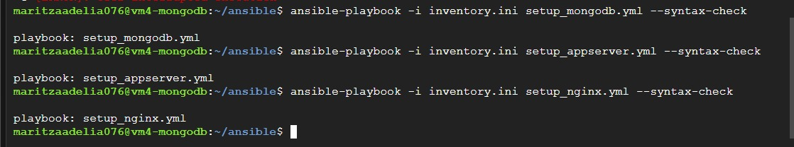

Setelah syntax check berhasil, jalankan semua playbook **sesuai urutan**:

```bash
# 1. Deploy database terlebih dahulu
ansible-playbook -i inventory.ini setup_mongodb.yml

# 2. Deploy backend
ansible-playbook -i inventory.ini setup_appserver.yml

# 3. Deploy load balancer
ansible-playbook -i inventory.ini setup_nginx.yml
```

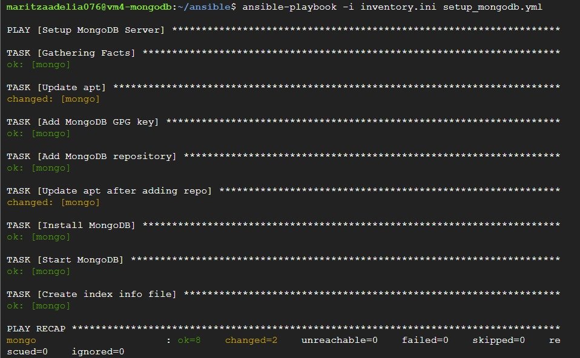

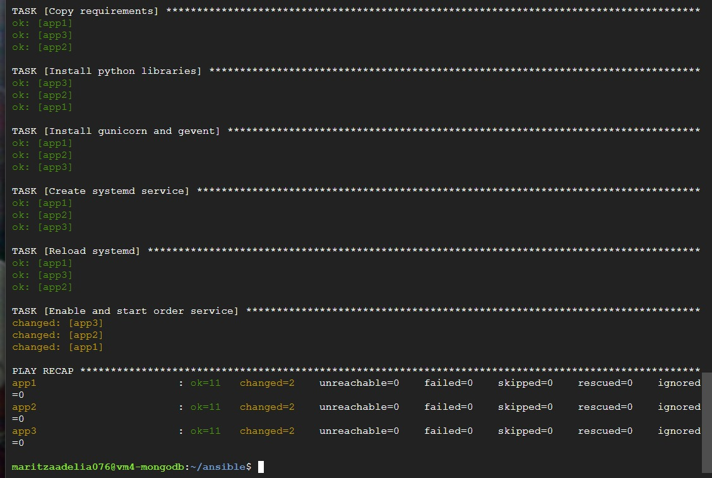

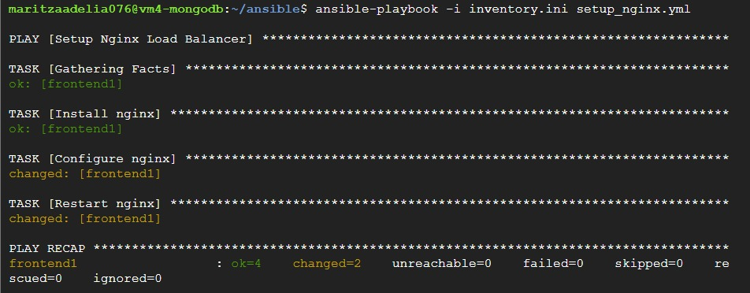

---

## 10.5 Testing Deployment

### Health Check via Load Balancer

```bash
curl http://34.101.72.188
curl http://34.101.72.188/health
```

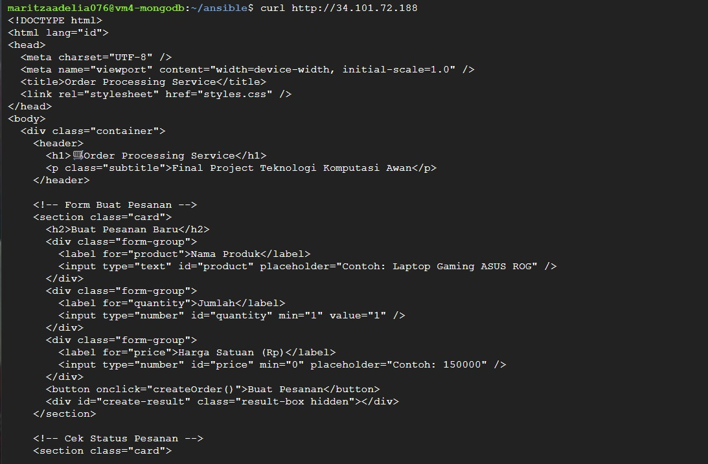

### Test Koneksi Langsung ke Backend (Gunicorn Port 5000)


---

## 11. Load Testing dengan Locust

Load testing dilakukan menggunakan `locustfile.py`, menembak ke Load Balancer Nginx (`http://34.50.117.141`). Tool dijalankan dari luar infrastruktur agar hasil benar-benar mengukur performa server, bukan ikut terbebani oleh proses Locust itu sendiri.

```bash
locust -f locustfile.py --host=http://34.50.117.141
```

`locustfile.py` mensimulasikan dua tipe pengguna secara bersamaan:
- **CustomerUser** (80% traffic) — browsing produk, membuat order, melihat riwayat order
- **AdminUser** (20% traffic) — dashboard stats, mengelola order, melihat data user & log

### 11.1 Metodologi

Setiap skenario dijalankan dengan pola sebagai berikut:
1. Set jumlah user dan spawn rate sesuai skenario
2. Jalankan pengujian selama 60 detik.
3. Catat hasil RPS tertinggi dengan failure rate 0% (Skenario 1) atau jumlah user tertinggi dengan failure rate 0% (Skenario 2–5).

### 11.2 Hasil Pengujian

| Skenario | Parameter | Hasil | Failure Rate |
|---|---|---|---|
| 1 | Spawn rate bertahap | RPS tertinggi: **163.66 RPS** @ 500 users | 0% |
| 2 | Spawn rate 50 | Max concurrent user: **1300 users** (14.8 RPS) | 0% |
| 3 | Spawn rate 100 | Max concurrent user: **1200 users** (15.72 RPS) | 0% |
| 4 | Spawn rate 200 | Max concurrent user: **1300 users** (18.892 RPS) | 0% |
| 5 | Spawn rate 500 | Max concurrent user: **1400 users** (16.17 RPS) | 0% |

Berdasarkan hasil pengujian, seluruh skenario berhasil dijalankan tanpa menghasilkan kegagalan (*failure rate* 0%). Pada pengujian peningkatan pengguna secara bertahap, sistem mampu mencapai throughput maksimum sebesar 163,66 request per second (RPS) pada beban 500 pengguna. Sementara itu, pada pengujian *peak concurrency*, sistem mampu mempertahankan antara 1.200–1.400 concurrent users bergantung pada nilai spawn rate yang digunakan.


### 11.3 Analisis

Pengaruh spawn rate terhadap kapasitas maksimal.

| Spawn Rate | Max Concurrent User Stabil |
|---|---|
| 50 | 1300 |
| 100 | 1200 |
| 200 | 1300 |
| 500 | 1400 |

Hasil pengujian menunjukkan bahwa seluruh skenario dapat dijalankan tanpa menghasilkan *failure rate* (0%). Kapasitas sistem berada pada kisaran 1.200–1.400 concurrent users, sedangkan throughput yang dicapai berada pada rentang 14,80–18,89 RPS.

Berdasarkan hasil pemantauan selama pengujian, komponen yang paling cepat mencapai kapasitas maksimum adalah VM App Server. Peningkatan jumlah pengguna menyebabkan beban komputasi pada server aplikasi meningkat secara signifikan, terutama pada penggunaan CPU dan memori untuk menangani proses aplikasi serta permintaan HTTP yang masuk.

Perbedaan nilai maksimum *concurrent users* pada setiap *spawn rate* relatif kecil dan tidak menunjukkan hubungan yang sepenuhnya linear. Hal ini mengindikasikan bahwa variasi *spawn rate* lebih memengaruhi pola kedatangan beban (*burst load*), sedangkan kapasitas sistem secara keseluruhan tetap dibatasi oleh kemampuan App Server dalam memproses permintaan secara bersamaan.

### 11.4 Screenshot Hasil Load Testing


**Skenario 1 — RPS Tertinggi (500 users)**
- Grafik RPS, Response Time, Failure Rate, & Number of Users: 
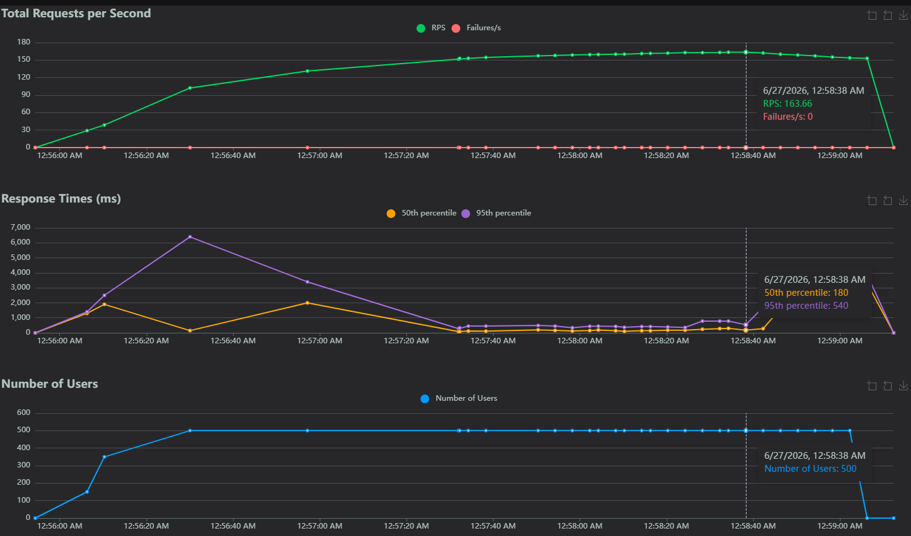
Max RPS: 164.66  
Max Users: 500
- CPU/Memory (htop) — MongoDB, App Server, & Frontend : 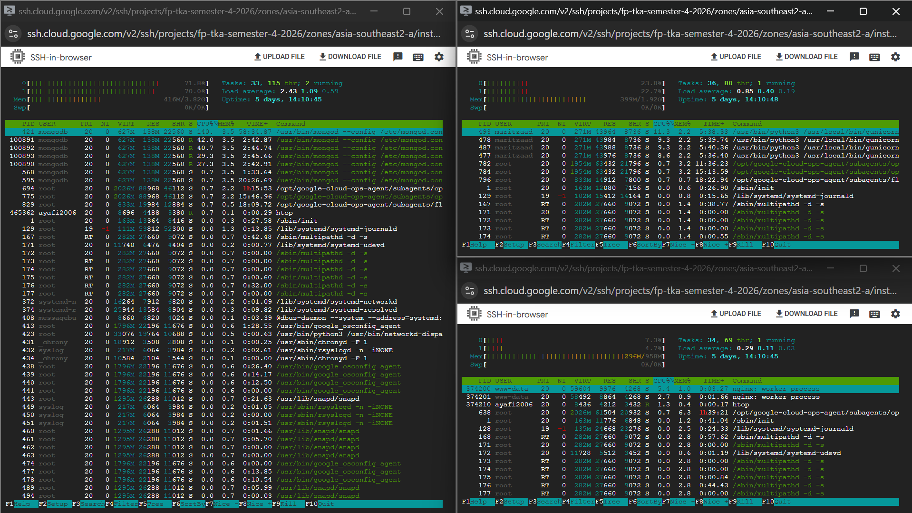

**Skenario 2 — Spawn Rate 50 (1300 users)**
- Grafik RPS, Response Time, Failure Rate, & Number of Users: 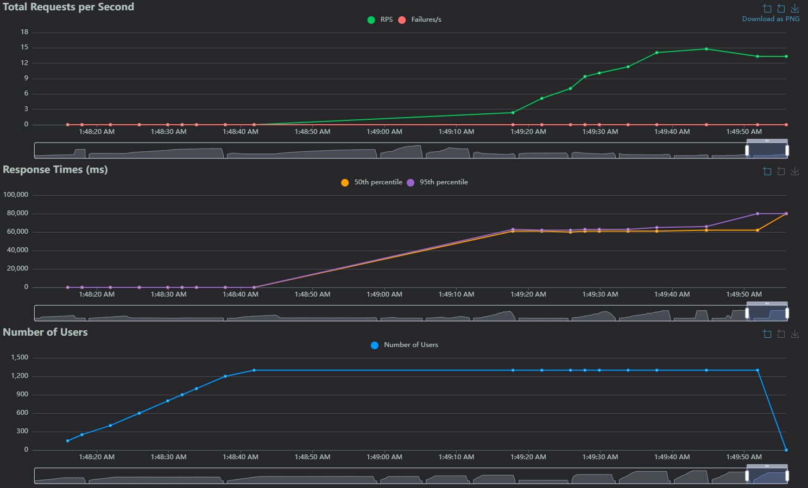
Max Users: 1300  
Max RPS: 14.8
- CPU/Memory (htop) — MongoDB, App Server, & Frontend: 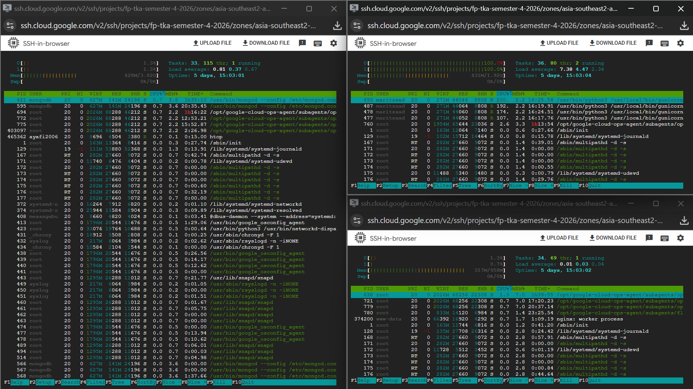

**Skenario 3 — Spawn Rate 100 (1200 users)**
- Grafik RPS, Response Time, Failure Rate, & Number of Users: 
Max Users: 1200  
Max RPS: 15.72
- CPU/Memory (htop) — MongoDB, App Server, & Frontend: 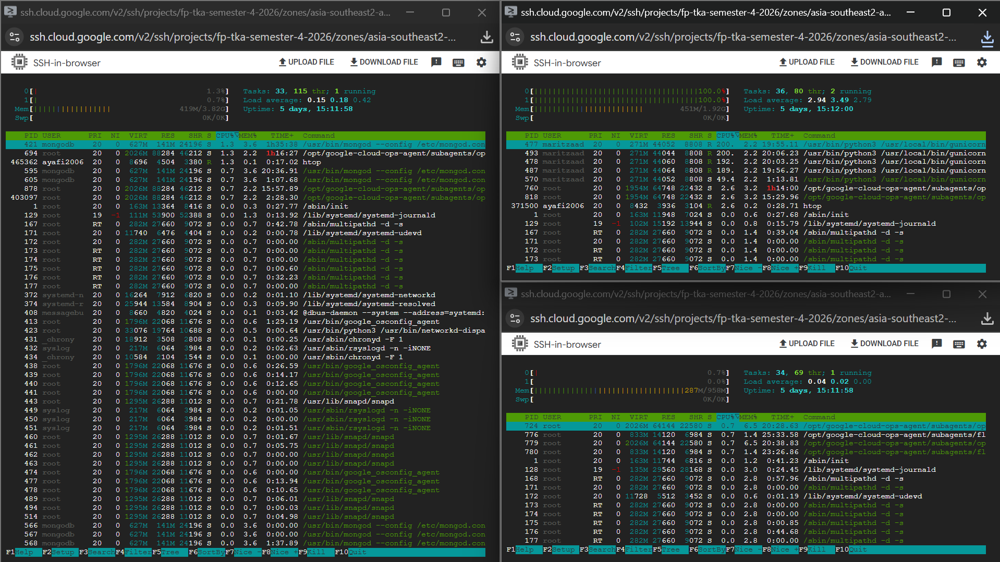

**Skenario 4 — Spawn Rate 200 (1300 users)**
- Grafik RPS, Response Time, Failure Rate, & Number of Users: 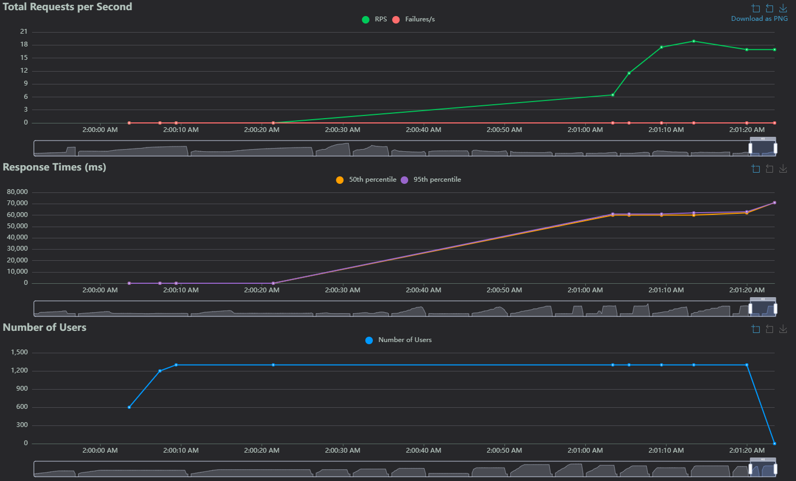
Max Users: 1300  
Max RPS: 18.892
- CPU/Memory (htop) — MongoDB, App Server, & Frontend: 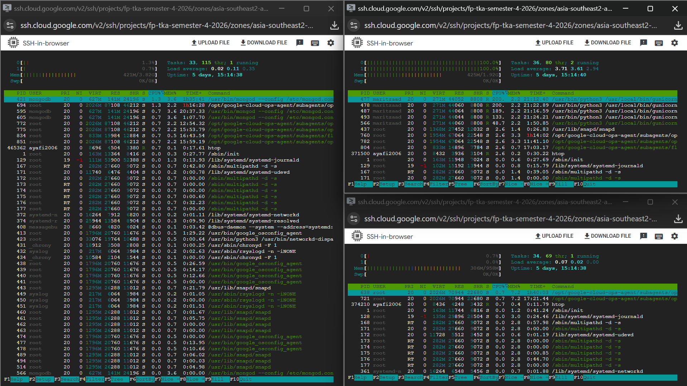 

**Skenario 5 — Spawn Rate 500 (1400 users)**
- Grafik RPS, Response Time, Failure Rate, & Number of Users: 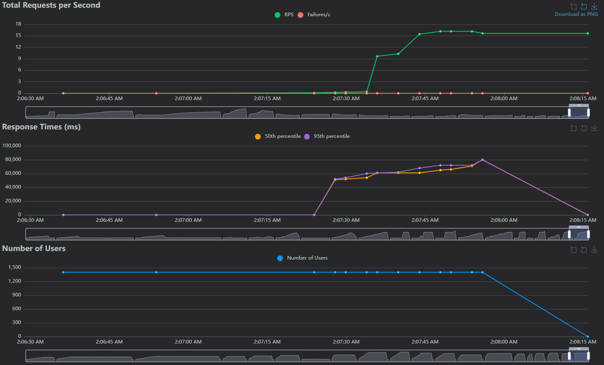
Max Users: 1400  
Max RPS: 16.17
- CPU/Memory (htop) — MongoDB, App Server, & Frontend: 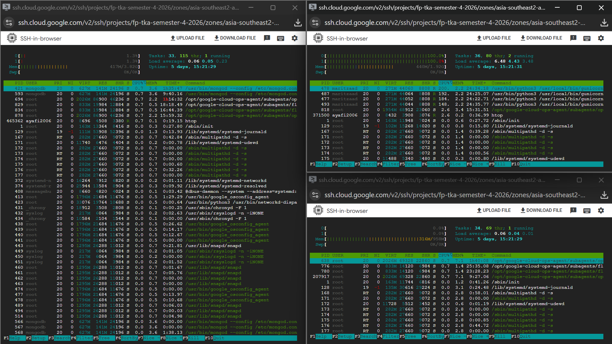

---

## 12. Test API Postman
### 12.1 POST /auth/register


### 12.2 POST /auth/login


### 12.3 GET /auth/me


### 12.4 GET /products


### 12.5 GET /products/<id>


### 12.6 POST /orders


### 12.7 GET /orders/<id>


### 12.8 PUT /orders/<id>/status


### 12.9 GET /admin/stats


### 12.10 GET /admin/users


### 12.11 GET /admin/logs


### 12.12 GET /health


