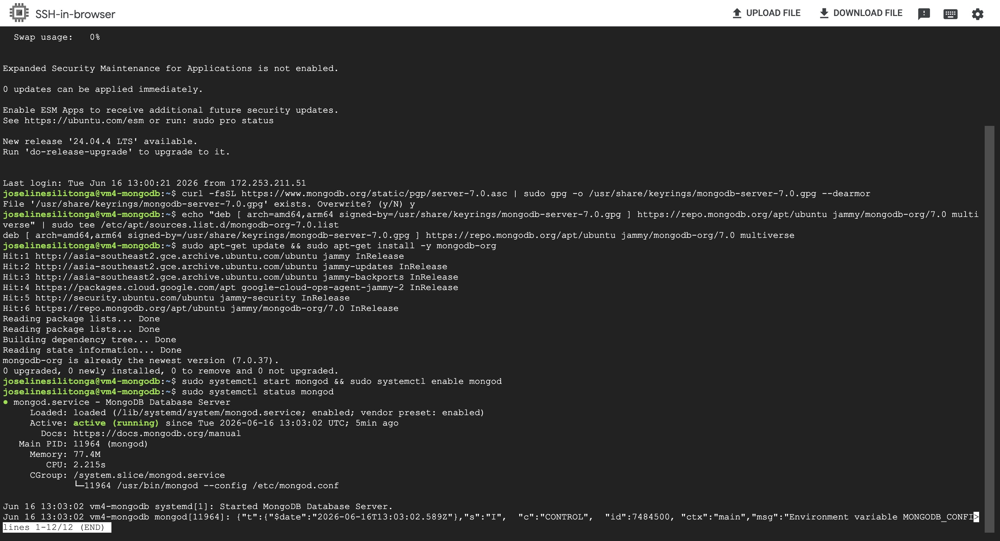
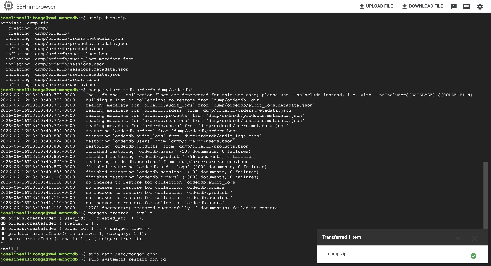
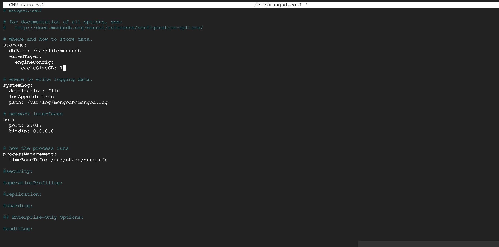
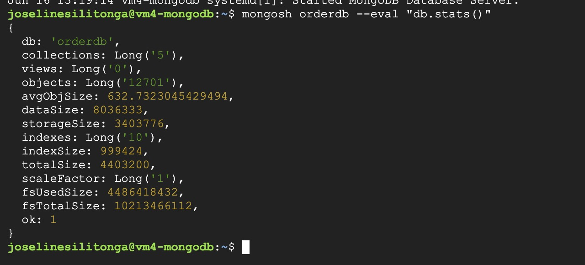

# Implementasi Database — MongoDB (vm4-mongodb)
> **VM:** `vm4-mongodb` | IP Internal: `10.184.0.6` | IP External: `34.101.207.8`
> **Spesifikasi:** 2 vCPU, 2 GB RAM, $18/bulan

---

## 1. Koneksi ke VM MongoDB

Akses VM melalui GCP Console:

1. Buka [https://console.cloud.google.com](https://console.cloud.google.com)
2. Login dengan akun Google yang sudah di-invite ke project
3. Navigasi ke **Compute Engine → VM Instances**
4. Cari baris `vm4-mongodb`, klik tombol **SSH**

Atau via terminal laptop:

```bash
ssh joselinesilitonga@34.101.207.8
```

---

## 2. Instalasi MongoDB 7.0

### 2.1 Import GPG Key

```bash
curl -fsSL https://www.mongodb.org/static/pgp/server-7.0.asc | sudo gpg -o /usr/share/keyrings/mongodb-server-7.0.gpg --dearmor
```

### 2.2 Tambahkan Repository MongoDB

```bash
echo "deb [ arch=amd64,arm64 signed-by=/usr/share/keyrings/mongodb-server-7.0.gpg ] https://repo.mongodb.org/apt/ubuntu jammy/mongodb-org/7.0 multiverse" | sudo tee /etc/apt/sources.list.d/mongodb-org-7.0.list
```

### 2.3 Install MongoDB

```bash
sudo apt-get update && sudo apt-get install -y mongodb-org
```

### 2.4 Jalankan dan Enable MongoDB

```bash
sudo systemctl start mongod && sudo systemctl enable mongod
```

### 2.5 Verifikasi Status

```bash
sudo systemctl status mongod
```

**Output yang diharapkan:**



> ✅ Pastikan statusnya `Active: active (running)` sebelum lanjut.

Tekan `q` untuk keluar dari tampilan status.

---

## 3. Restore Database dari Dump

### 3.1 Siapkan File Dump (di laptop lokal)

```bash
cd ~/Downloads
unzip fp-tka-26-main.zip
cd fp-tka-26-main/Resources/DB
zip -r dump.zip dump/
```

### 3.2 Upload ke VM

Di browser SSH, klik tombol **UPLOAD FILE** (pojok kanan atas), lalu pilih file `dump.zip` yang baru dibuat.

### 3.3 Install Unzip di VM

```bash
sudo apt install unzip -y
```

### 3.4 Ekstrak File Dump

```bash
unzip dump.zip
```

### 3.5 Restore ke MongoDB

```bash
mongorestore --db orderdb dump/orderdb/
```

**Output yang diharapkan:**



> ✅ Pastikan ada baris `12701 document(s) restored successfully. 0 document(s) failed to restore.`

Data yang ter-restore:
| Collection | Jumlah Dokumen |
|---|---|
| users | 505 |
| products | 96 |
| orders | 10.000 |
| audit_logs | 2.000 |
| sessions | 100 |

---

## 4. Pembuatan Index

Index diperlukan untuk mempercepat query, terutama pada endpoint `/admin/stats` yang memiliki aggregation pipeline berat.

```bash
mongosh orderdb --eval "
db.orders.createIndex({ user_id: 1, created_at: -1 });
db.orders.createIndex({ status: 1 });
db.orders.createIndex({ order_id: 1 }, { unique: true });
db.products.createIndex({ is_active: 1, category: 1 });
db.users.createIndex({ email: 1 }, { unique: true });
"
```

> ✅ MongoDB akan menampilkan nama index yang berhasil dibuat untuk setiap perintah.

---

## 5. Konfigurasi mongod.conf

### 5.1 Buka File Konfigurasi

```bash
sudo nano /etc/mongod.conf
```

### 5.2 Ubah Konfigurasi

Edit file sehingga menjadi seperti berikut:

```yaml
# mongod.conf

storage:
  dbPath: /var/lib/mongodb
  wiredTiger:
    engineConfig:
      cacheSizeGB: 1        # Tuning cache = setengah RAM vm4 (2GB)

systemLog:
  destination: file
  logAppend: true
  path: /var/log/mongodb/mongod.log

net:
  port: 27017
  bindIp: 0.0.0.0          # Agar bisa diakses dari app server lain

processManagement:
  timeZoneInfo: /usr/share/zoneinfo
```

**Screenshot konfigurasi:**



Simpan dengan: `Ctrl+X` → `Y` → `Enter`

### 5.3 Restart MongoDB

```bash
sudo systemctl restart mongod && sudo systemctl status mongod
```

---

## 6. Verifikasi Koneksi dan Data

### 6.1 Cek via URI Internal

```bash
mongosh mongodb://10.184.0.6:27017/orderdb --eval "db.stats()"
```

### 6.2 Tampilkan Statistik Database

```bash
mongosh orderdb --eval "db.stats()"
```

**Output yang diharapkan:**



```json
{
  db: 'orderdb',
  collections: Long('5'),
  views: Long('0'),
  objects: Long('12701'),
  indexes: Long('10'),
  ok: 1
}
```

> ✅ Pastikan `collections: 5`, `objects: 12701`, `indexes: 10`, dan `ok: 1`

---

## 7. Ringkasan Konfigurasi MongoDB

| Parameter | Nilai |
|---|---|
| Versi | MongoDB 7.0 |
| Port | 27017 |
| Database | orderdb |
| bindIp | 0.0.0.0 |
| WiredTiger Cache | 1 GB |
| Total Index | 10 |
| Total Dokumen | 12.701 |

**MONGO_URI untuk App Server:**
```
mongodb://10.184.0.6:27017/orderdb
```

## 8. Deployment Backend (App Server)
Layanan backend dideploy menggunakan Gunicorn dengan 4 worker pada 3 instance terpisah untuk mendukung load balancing.<br>
**Konfigurasi Instance:**
- Web Server: Gunicorn (WSGI HTTP Server)
- Virtual Environment: Python 3.10 venv
- Dependency: Flask, PyMongo, Bcrypt, PyJWT, Gunicorn
- Port: 5000 (Internal)
<br>
**Daftar Instance Backend:**
  | **Instance** | **IP Adrress** |
  | App Server 1 (Redis) | 34.101.207.217:5000 |
  | App Server 2 | 34.128.83.168:5000 |
  | App Server 3 | 34.50.119.137:5000 |

  Lalu jalankan perintah 
```
  # Setup Environment
source venv/bin/activate
export MONGO_URI="mongodb://10.184.0.6:27017/orderdb"

# Menjalankan Gunicorn sebagai daemon
gunicorn -w 4 -b 0.0.0.0:5000 app:app --daemon
```
  
